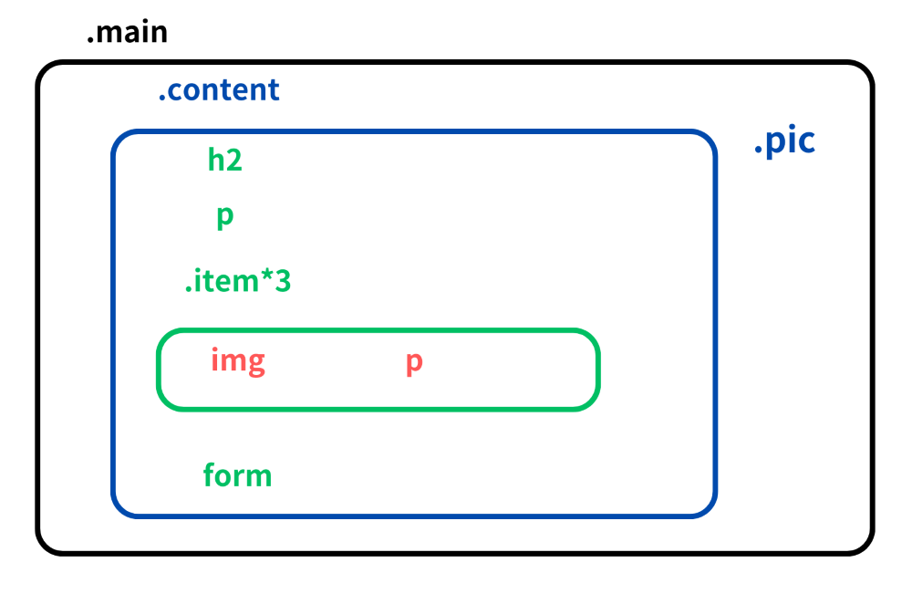
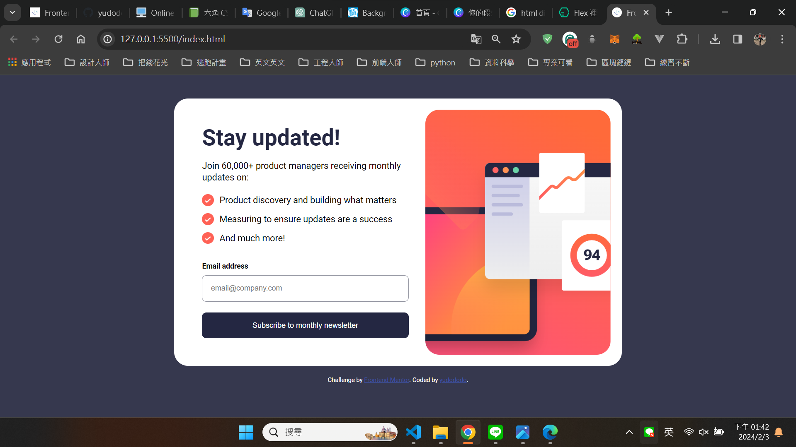
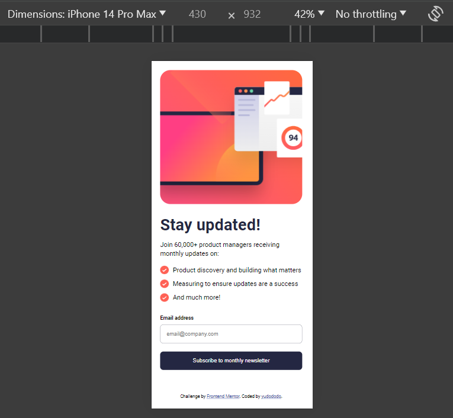
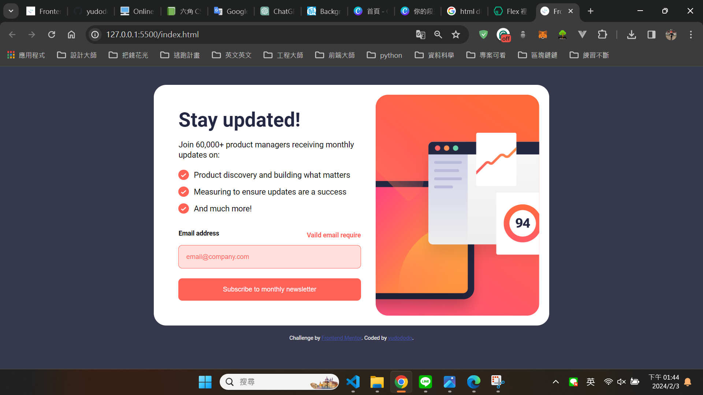
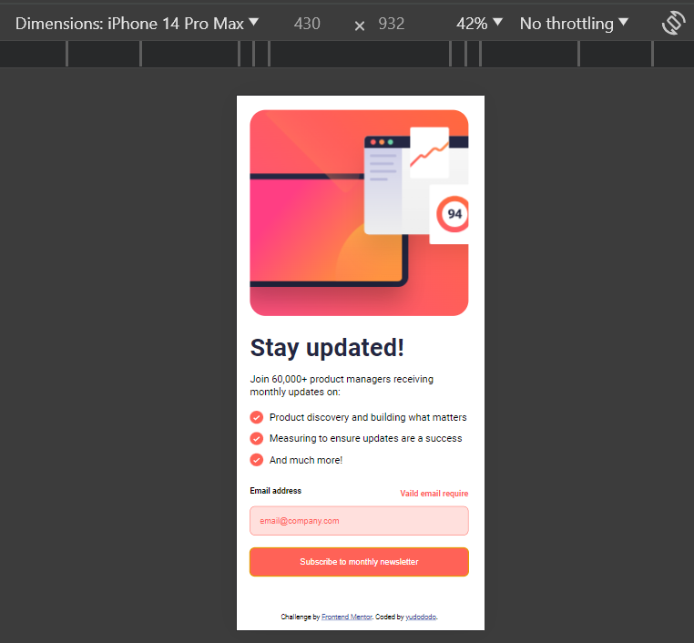
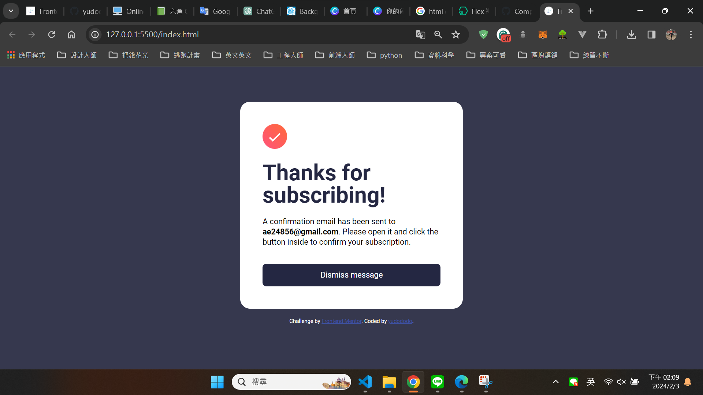
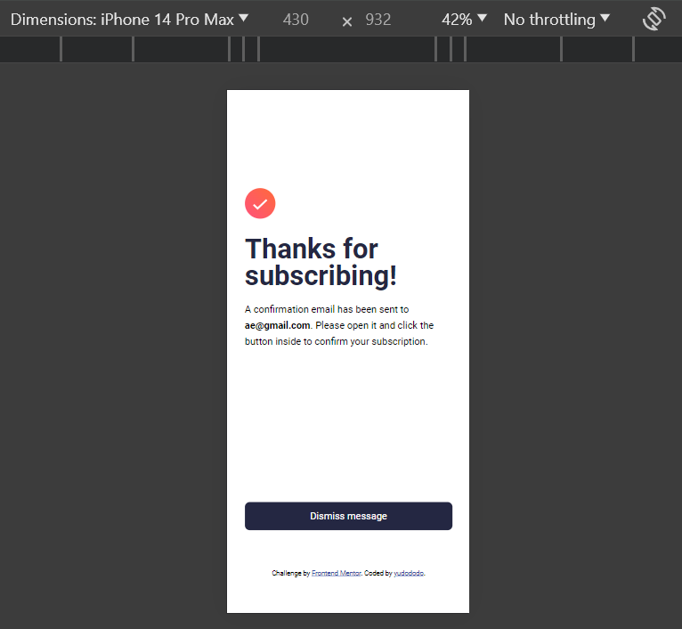

## Overview👀

Hello visitors, I created this github repo to help me practice and showcase my not so refined html, css and JS skill.
Hope that you get a grasp of my current front end skills and help me improve what I lack by sending feedbacks.🙏🙏🙏 

## Layout🌼

  
  

## Screenshot🐻💥

  
  

 
 

  
  

 

 
  

## The challenge🔥

Users should be able to:

Your users should be able to:

- Add their email and submit the form
- See a success message with their email after successfully submitting the form
- See form validation messages if:
  - The field is left empty
  - The email address is not formatted correctly
- View the optimal layout for the interface depending on their device's screen size
- See hover and focus states for all interactive elements on the page

## What I learned💪

Learn to create a form with HTML, CSS and JS

## Author🐶

- Frontend Mentor - [@yudododo](https://www.frontendmentor.io/profile/yudododo)
- Instagram - [@yu_dododo](https://www.instagram.com/yu_dododo/)
