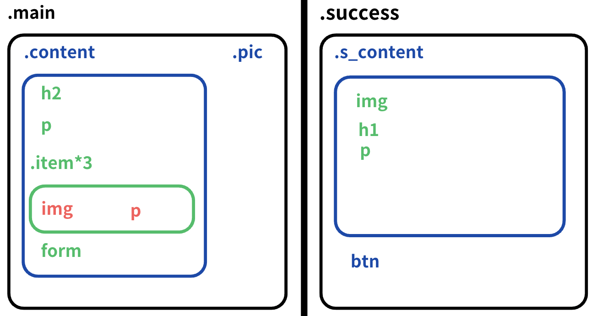

# Overview 👀

用來判斷使用者輸入的 Email 是否正確，並搭配簡易的響應式設計

## Demo 🐻💥

<!-- <div style="display: flex; justify-content:center;">
  
  
</div>
<br>

<div style="display: flex; justify-content:center;" >
  
  
</div>

<br>

<div style="display:flex; justify-content:center;">

  
</div> -->

<https://yudododo.github.io/newsletter-sign-up-with-success-message-yu/>

## Layout 🌼



## The challenge 🔥

Users should be able to:

- Add their email and submit the form
- See a success message with their email after successfully submitting the form
- See form validation messages if:
  - The field is left empty
  - The email address is not formatted correctly

## What I learned💪

- 正則表達式的應用，用來判斷 email 是否符合「名稱@域名.com」的格式

``` javaScript
const emailPattern = /^[a-zA-Z0-9._-]+@.+\.com$/;
```

- ^ ➡️ 表示字串開頭
- [a-zA-Z0-9._-]+ ➡️ Email 名稱部分
- .+ ➡️ @後面至少一個任意字元
- \.com$ ➡️ 必須以 .com 結尾

## Author 🐶

- Frontend Mentor - [@yudododo](https://www.frontendmentor.io/profile/yudododo)
- Instagram - [@yu_dododo](https://www.instagram.com/yu_dododo/)
